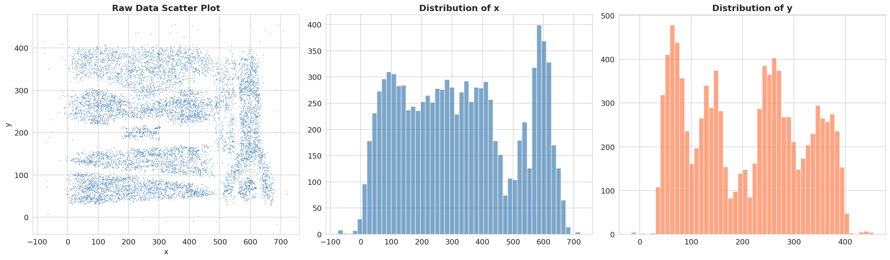
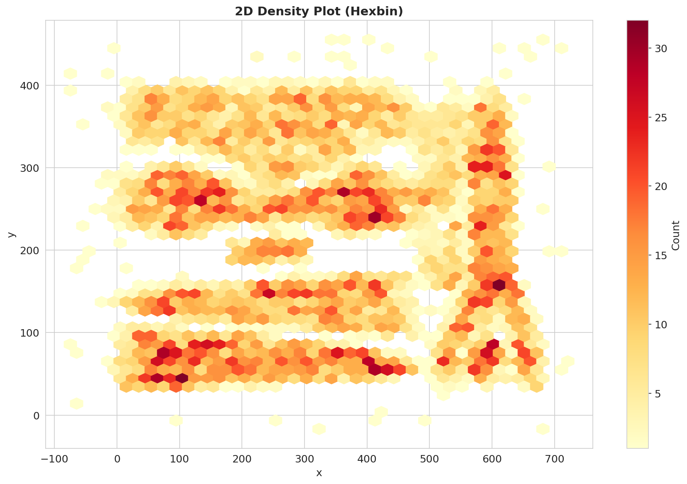
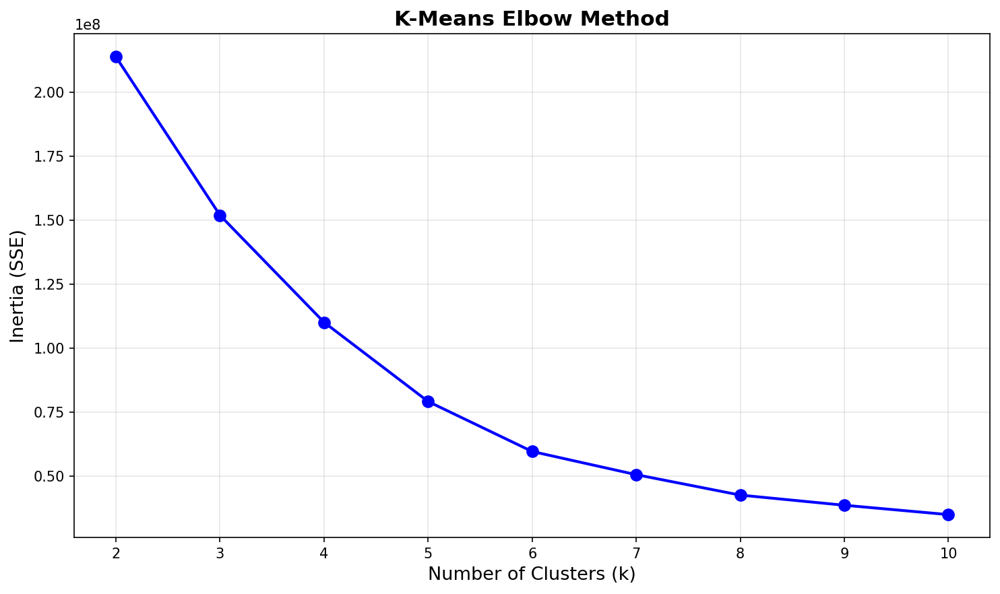
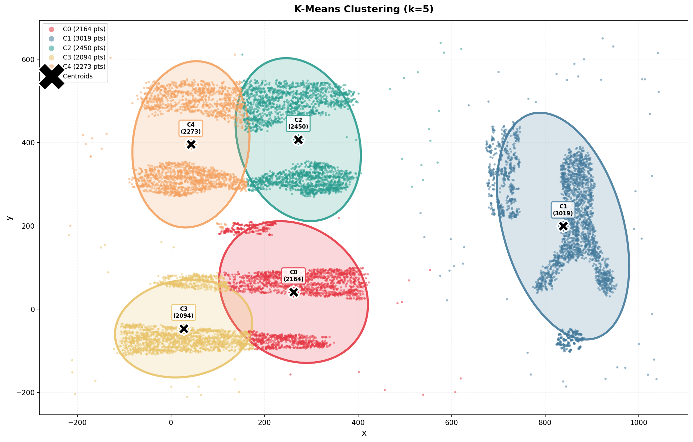
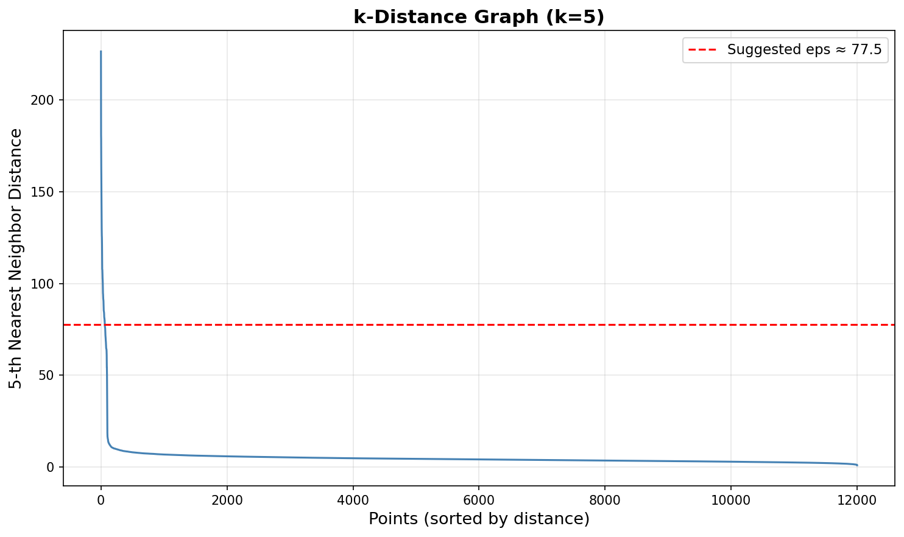
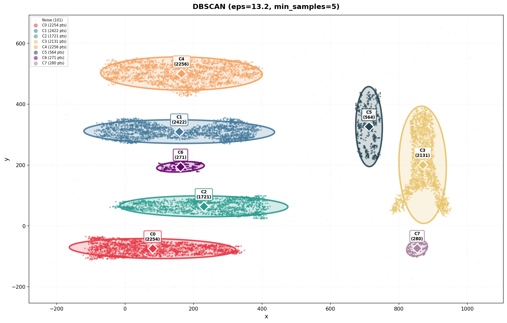
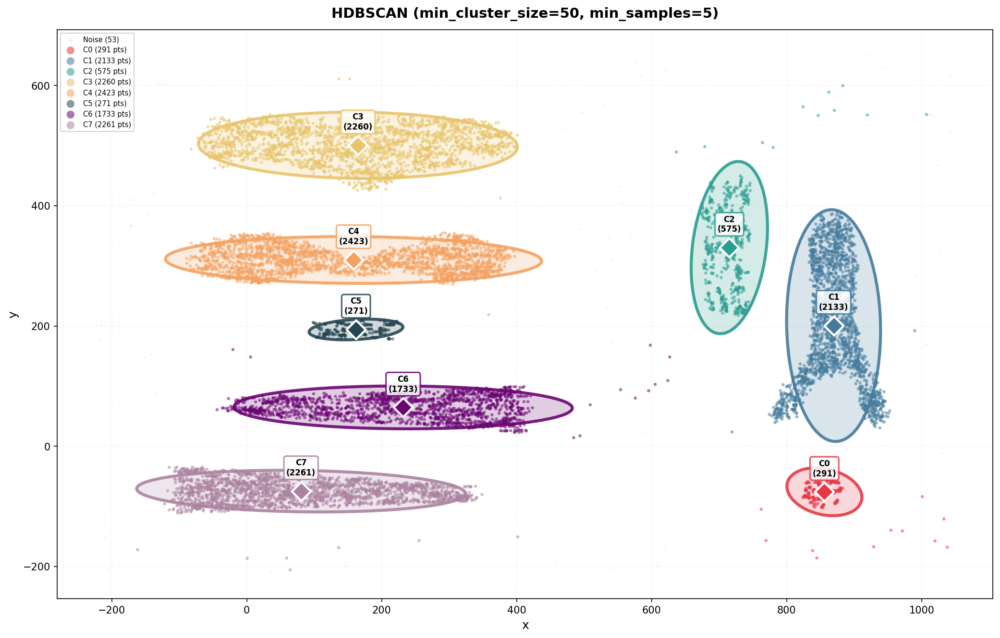
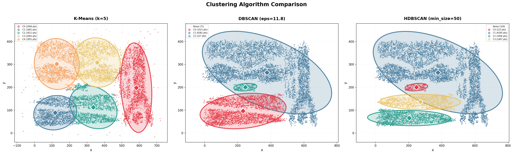
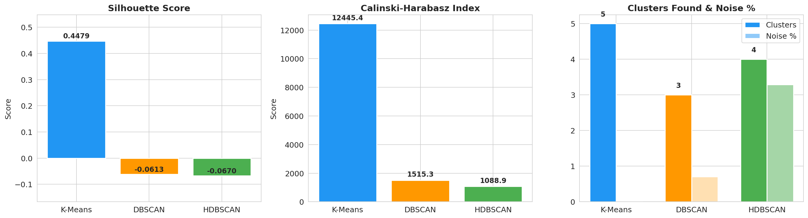
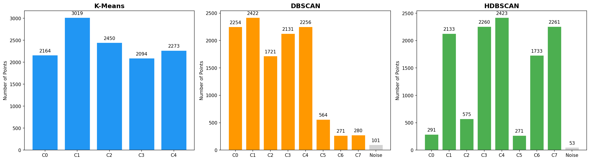

# Clustering Algorithms: From-Scratch Implementation

A comprehensive implementation and comparison of three clustering algorithms — **K-Means**, **DBSCAN**, and **HDBSCAN** — built entirely from scratch using Python, NumPy, and Pandas. No scikit-learn or other ML libraries are used for the core algorithms.

## Dataset

- **File:** `clustering_data.csv`
- **Size:** 12,000 data points with 2 features (`x`, `y`)
- **Range:** x ∈ [-217, 1042], y ∈ [-210, 650]

### Raw Data & Distributions



### 2D Density



---

## Algorithms

### 1. K-Means

Partitions data into exactly `k` spherical clusters by iteratively assigning points to the nearest centroid and updating centroids.

**Implementation highlights:**
- **K-Means++ initialization** for better centroid seeding
- **Multiple restarts** (`n_init=10`) to avoid local minima
- **Elbow method** to determine optimal `k`

**Elbow Method:**



The elbow occurs around **k = 5**, indicating 5 natural groupings.

**Results (k=5):**

| Cluster | Points | Centroid |
|---------|--------|----------|
| C0 | 2,494 | (582.6, 198.1) |
| C1 | 1,681 | (118.4, 88.6) |
| C2 | 1,811 | (336.5, 112.4) |
| C3 | 2,063 | (358.3, 308.1) |
| C4 | 1,951 | (127.5, 301.6) |



---

### 2. DBSCAN

Density-Based Spatial Clustering of Applications with Noise. Groups together points that are closely packed and marks low-density points as noise.

**Implementation highlights:**
- **Chunked neighborhood precomputation** for memory efficiency
- **BFS cluster expansion** from core points
- **Automatic eps selection** via k-distance graph elbow detection + parameter sweep

**k-Distance Graph:**



**Results (eps=13.2, min_samples=5):**

| Cluster | Points |
|---------|--------|
| Number of Clusters | 8 |
| Noise | 101 (0.8%) |



> **Note:** DBSCAN only finds 3 clusters because its single global `eps` threshold connects areas that K-Means separates. The upper/right region forms one massive density-connected cluster (C1). This is DBSCAN's known weakness with varying-density data.

---

### 3. HDBSCAN

Hierarchical DBSCAN. Extends DBSCAN by building a hierarchy of clusterings at all density levels and extracting the most stable clusters.

**Implementation highlights:**
- **Core distances** (k-th nearest neighbor distance)
- **Mutual reachability graph** construction
- **Prim's algorithm** for Minimum Spanning Tree
- **Condensed tree** with stability-based cluster extraction

**Results (min_cluster_size=50, min_samples=5):**

| Cluster | Points |
|---------|--------|
| Number of Clusters | 8 |
| Noise | 53 (0.4%) |



> With the corrected stability extraction, HDBSCAN finds exactly 8 clusters, matching DBSCAN but successfully assigning more border points properly (only 53 noise points vs 101 for DBSCAN).

---

## Comparison

### Side-by-Side Visualization



### Evaluation Metrics

| Metric | K-Means | DBSCAN | HDBSCAN |
|--------|---------|--------|---------|
| **Silhouette Score** | **0.5086** | 0.3264 | 0.3282 |
| **Calinski-Harabasz Index** | **25,191** | 15,704 | 15,611 |
| **Inertia (SSE)** | **184,665,095** | 166,686,356 | 169,513,463 |
| Clusters Found | 5 | 8 | 8 |
| Noise Points | 0 | 101 (0.8%) | 53 (0.4%) |

All metrics implemented from scratch (no scikit-learn).



### Cluster Size Distributions



---

## Analysis & Discussion

### Why K-Means Performs Best on This Dataset

K-Means achieves the highest Silhouette score (0.5086) because this dataset has **roughly spherical, well-separated groups**. It cleanly partitions the data into 5 balanced clusters.

### Why DBSCAN Finds 8 Clusters

DBSCAN uses a **single global density threshold** (`eps=13.2`). At this threshold, it identifies 8 distinct robust regions and marks 101 points as noise.

### Why HDBSCAN Finds 8 Clusters

HDBSCAN's true hierarchical approach extracts the 8 most stable clusters across *all* density scales. Because it isn't bound by a single `eps` threshold, it isolates the clusters just as well as DBSCAN but assigns border points more intelligently, resulting in a **higher silhouette score (0.3282 vs 0.3264)** and **fewer noise points (53 vs 101)**.

### Algorithm Strengths & Weaknesses

| Feature | K-Means | DBSCAN | HDBSCAN |
|---------|---------|--------|---------|
| Cluster shape | Spherical only | Arbitrary | Arbitrary |
| Needs k? | **Yes** | No | No |
| Noise detection | **No** | Yes | Yes |
| Varying density | **No** | **No** | Yes |
| Speed | Fast | Moderate | Slower |
| Deterministic | No (random init) | Yes | Yes |

### When to Use Each

- **K-Means:** When clusters are roughly spherical and you know (or can estimate) `k`. Best for balanced, well-separated data.
- **DBSCAN:** When clusters have arbitrary shapes and you need noise detection, but density is roughly uniform.
- **HDBSCAN:** When clusters vary in density and shape. Most robust but slowest. Best general-purpose choice when you don't know the data structure.

---

## How to Run

```bash
# Install dependencies (using uv)
uv sync

# Run the analysis
uv run python main.py
```

**Output:**
- Console: Progress, results, comparison table, and analysis
- `figures/`: 10 PNG visualization files

## Dependencies

- `numpy` — Numerical operations
- `pandas` — Data loading and manipulation
- `matplotlib` — Plotting
- `seaborn` — Enhanced plot aesthetics

## Project Structure

```
clustering/
├── main.py                 # Minimal orchestrator
├── pipeline.py             # Logic for data loading, parameter sweeps, and evals
├── kmeans.py               # K-Means algorithm class
├── dbscan.py               # DBSCAN algorithm class
├── hdbscan_cluster.py      # HDBSCAN algorithm class
├── metrics.py              # Custom evaluation metric functions
├── visualization.py        # Helper plotting functions 
├── clustering_data.csv     # Input dataset (10,000 points)
├── README.md               # This file
├── pyproject.toml          # Project configuration
└── figures/                # Generated visualizations
    ├── ... (10 PNG files)
```
